# 코인 선물 자동매매 시스템 - C4 모델 소프트웨어 아키텍처 문서

## 1. 개요

본 문서는 코인 선물 자동매매 시스템의 소프트웨어 아키텍처를 C4 모델(Context, Container, Component, Code)로 체계적으로 정리한 문서입니다.

---

## 2. Level 1: System Context Diagram

### 2.1 시스템 컨텍스트

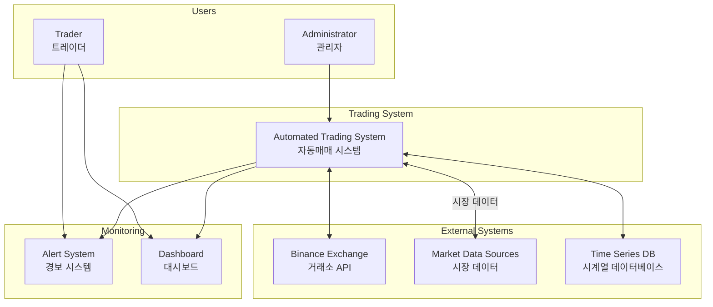

### 2.2 주요 액터 및 외부 시스템

| 액터/시스템 | 설명 | 상호작용 |
|------------|------|---------|
| **Trader** | 시스템 사용자 | 대시보드 모니터링, 알림 수신 |
| **Administrator** | 시스템 관리자 | 설정 관리, 시스템 제어 |
| **Binance Exchange** | 거래소 API | 주문 실행, 계좌 관리, 실시간 데이터 |
| **Market Data Sources** | 외부 데이터 제공자 | 가격, 거래량, 펀딩레이트 |
| **Alert System** | 알림 시스템 | Slack, Email 알림 |

---

## 3. Level 2: Container Diagram

### 3.1 컨테이너 아키텍처

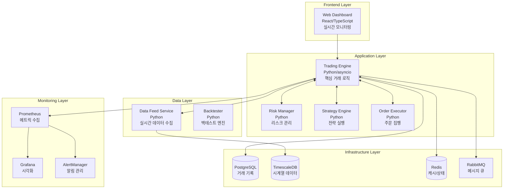

### 3.2 컨테이너 상세 명세

| 컨테이너 | 기술 스택 | 책임 | 통신 방식 |
|---------|----------|------|----------|
| **Trading Engine** | Python 3.10+, asyncio | 메인 거래 조정 | REST, WebSocket |
| **Risk Manager** | Python, NumPy, SciPy | 리스크 평가 및 제어 | gRPC |
| **Strategy Engine** | Python, pandas, scikit-learn | 전략 신호 생성 | gRPC |
| **Order Executor** | Python, asyncio | 주문 라우팅 및 실행 | REST API |
| **Data Feed Service** | Python, asyncio | 실시간 데이터 수집 | WebSocket |
| **PostgreSQL** | PostgreSQL 14+ | 거래 기록 저장 | SQL |
| **TimescaleDB** | TimescaleDB 2.0+ | 시계열 데이터 | SQL |
| **Redis** | Redis 7.0+ | 캐싱, 상태 관리 | Redis Protocol |

---

## 4. Level 3: Component Diagram

### 4.1 Trading Engine 컴포넌트

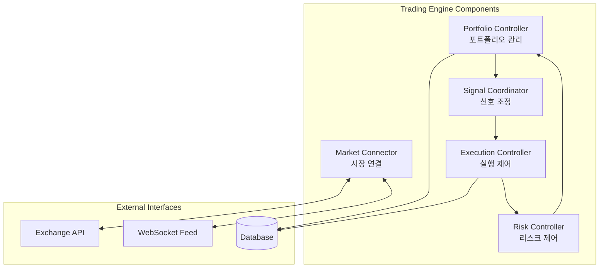

### 4.2 Risk Manager 컴포넌트

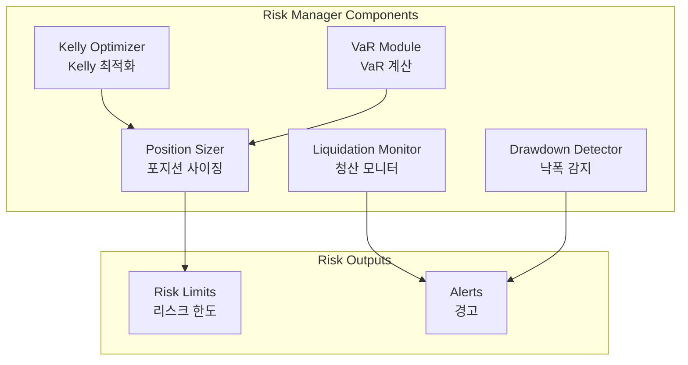

### 4.3 Strategy Engine 컴포넌트

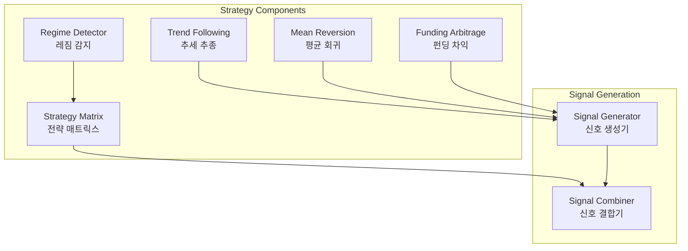

### 4.4 주요 컴포넌트 명세

| 컴포넌트 | 책임 | 입력 | 출력 |
|---------|------|------|------|
| **Portfolio Controller** | 포트폴리오 상태 관리 | 포지션, 잔고 | 자본 상태 |
| **Kelly Optimizer** | 최적 베팅 비율 계산 | 수익률 분포 | 최적 비율 |
| **Regime Detector** | 시장 레짐 식별 | 가격, 변동성 | 레짐 상태 |
| **Position Sizer** | 포지션 크기 결정 | 신호, 리스크 | 주문 크기 |
| **Liquidation Monitor** | 청산 위험 모니터링 | 포지션, 가격 | 청산 확률 |
| **Signal Generator** | 거래 신호 생성 | 시장 데이터 | 매수/매도 신호 |

---

## 5. Level 4: Code Diagram

### 5.1 핵심 클래스 다이어그램

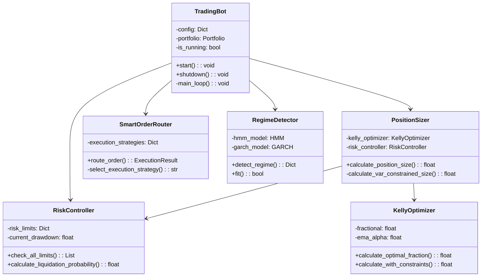

### 5.2 주요 시퀀스 다이어그램

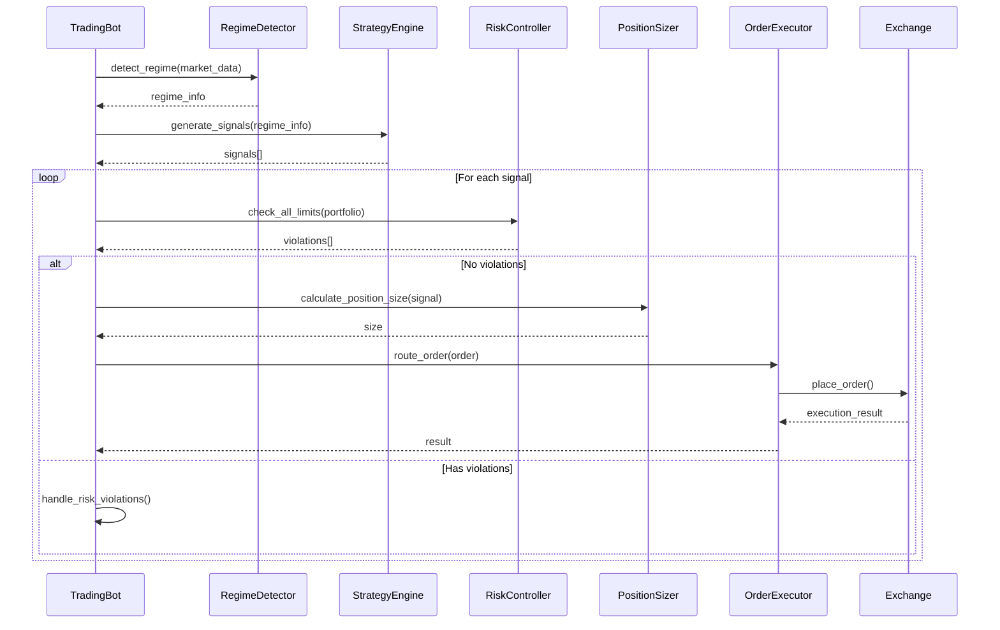

---

## 6. 데이터 흐름

### 6.1 실시간 데이터 파이프라인

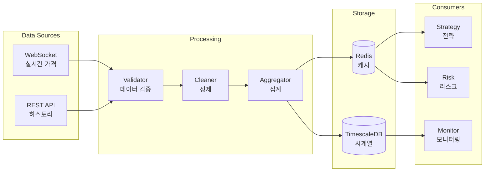

---

## 7. 배포 아키텍처

### 7.1 인프라 구성

```yaml
infrastructure:
  environments:
    development:
      type: "Local Docker"
      resources:
        cpu: "2 cores"
        memory: "4GB"
        storage: "20GB"
    
    staging:
      type: "VPS"
      provider: "AWS/DigitalOcean"
      resources:
        cpu: "4 cores"
        memory: "8GB"
        storage: "100GB"
      network:
        bandwidth: "1Gbps"
        latency: "<50ms to exchange"
    
    production:
      type: "Dedicated Server"
      location: "Near exchange servers"
      resources:
        cpu: "8+ cores"
        memory: "16GB+"
        storage: "500GB SSD"
      redundancy:
        primary: "Server A"
        backup: "Server B"
        failover: "Automatic"
```

### 7.2 컨테이너 오케스트레이션

```yaml
docker-compose:
  version: "3.8"
  
  services:
    trading-engine:
      build: ./trading-engine
      replicas: 1
      restart: always
      depends_on:
        - postgres
        - redis
        - timescaledb
    
    risk-manager:
      build: ./risk-manager
      replicas: 1
      restart: always
      healthcheck:
        test: ["CMD", "python", "health_check.py"]
        interval: 10s
    
    data-feed:
      build: ./data-feed
      replicas: 2
      restart: always
    
    postgres:
      image: postgres:14
      volumes:
        - postgres-data:/var/lib/postgresql/data
    
    redis:
      image: redis:7-alpine
      command: redis-server --appendonly yes
    
    prometheus:
      image: prom/prometheus
      ports:
        - "9090:9090"
    
    grafana:
      image: grafana/grafana
      ports:
        - "3000:3000"
```

---

## 8. 보안 아키텍처

### 8.1 보안 계층

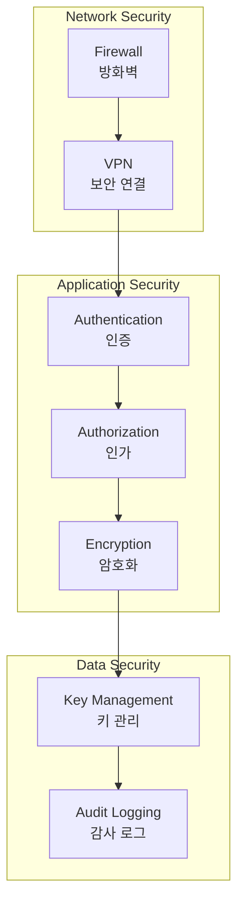

### 8.2 보안 정책

| 영역 | 정책 | 구현 |
|-----|------|------|
| **API Keys** | 환경 변수 사용 | AWS Secrets Manager |
| **네트워크** | IP 화이트리스트 | iptables/AWS Security Groups |
| **데이터** | 전송 중/저장 시 암호화 | TLS 1.3, AES-256 |
| **접근 제어** | 역할 기반 접근 제어 | RBAC |
| **감사** | 모든 거래 활동 로깅 | Audit Trail |

---

## 9. 모니터링 및 알림

### 9.1 모니터링 스택

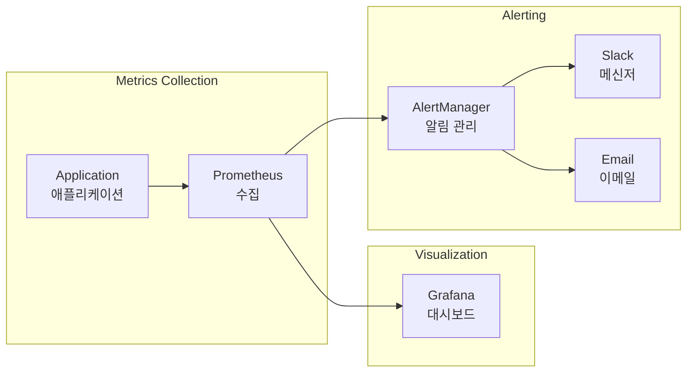

### 9.2 핵심 메트릭

| 카테고리 | 메트릭 | 임계값 | 알림 레벨 |
|---------|--------|--------|----------|
| **Performance** | Sharpe Ratio | < 1.0 | Warning |
| **Risk** | Drawdown | > 10% | Critical |
| **Risk** | VaR Breach | > limit | Critical |
| **System** | API Latency | > 1000ms | Warning |
| **System** | Error Rate | > 5% | Critical |
| **Execution** | Slippage | > 50bps | Warning |

---

## 10. 개발 및 테스트 전략

### 10.1 CI/CD 파이프라인

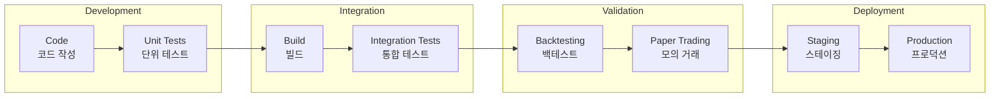

### 10.2 테스트 전략

| 테스트 유형 | 범위 | 도구 | 빈도 |
|------------|------|------|------|
| **Unit Tests** | 개별 함수/클래스 | pytest | 커밋마다 |
| **Integration Tests** | 컴포넌트 간 | pytest + Docker | PR마다 |
| **Backtesting** | 전략 검증 | 자체 엔진 | 일일 |
| **Paper Trading** | 실시간 검증 | Testnet | 주간 |
| **Load Testing** | 성능 검증 | Locust | 릴리즈 전 |

---

## 11. 확장성 고려사항

### 11.1 수평 확장 전략

```yaml
scalability:
  data_feed:
    strategy: "Multiple instances"
    load_balancing: "Round-robin"
    
  strategy_engine:
    strategy: "Parallel processing"
    distribution: "By symbol"
    
  order_executor:
    strategy: "Queue-based"
    queue: "RabbitMQ"
    workers: "Auto-scaling"
    
  database:
    strategy: "Sharding"
    shard_key: "symbol"
    replicas: 3
```

### 11.2 성능 최적화

| 영역 | 최적화 방법 | 기대 효과 |
|-----|------------|----------|
| **데이터 처리** | 배치 처리, 캐싱 | 지연시간 50% 감소 |
| **전략 계산** | 벡터화, 병렬처리 | 처리량 3배 증가 |
| **주문 실행** | 연결 풀링, 비동기 | 응답시간 70% 개선 |
| **데이터베이스** | 인덱싱, 파티셔닝 | 쿼리 성능 10배 향상 |

---

## 12. 운영 가이드

### 12.1 시작 절차

```bash
# 1. 환경 설정
export BINANCE_API_KEY=your_key
export BINANCE_API_SECRET=your_secret

# 2. 데이터베이스 초기화
python scripts/init_db.py

# 3. 설정 검증
python scripts/validate_config.py --config config.yaml

# 4. 사전 체크
python scripts/pre_operation_check.py

# 5. 시스템 시작
python main.py --config config.yaml --mode paper
```

### 12.2 정지 절차

```bash
# 1. 신규 주문 중지
python scripts/halt_new_orders.py

# 2. 대기 주문 취소
python scripts/cancel_pending_orders.py

# 3. 포지션 정리 (선택적)
python scripts/close_positions.py --gradual

# 4. 시스템 종료
python scripts/shutdown.py --graceful
```

---

## 13. 장애 대응

### 13.1 장애 시나리오 및 대응

| 시나리오 | 감지 방법 | 자동 대응 | 수동 대응 |
|---------|----------|----------|----------|
| **API 연결 끊김** | Health check | 재연결 시도 | 대체 엔드포인트 |
| **과도한 드로다운** | 실시간 모니터링 | Kill switch | 포지션 축소 |
| **데이터 이상** | 통계적 검증 | 거래 중지 | 데이터 소스 전환 |
| **시스템 과부하** | CPU/메모리 모니터링 | 자동 스케일링 | 수동 재시작 |

### 13.2 복구 절차

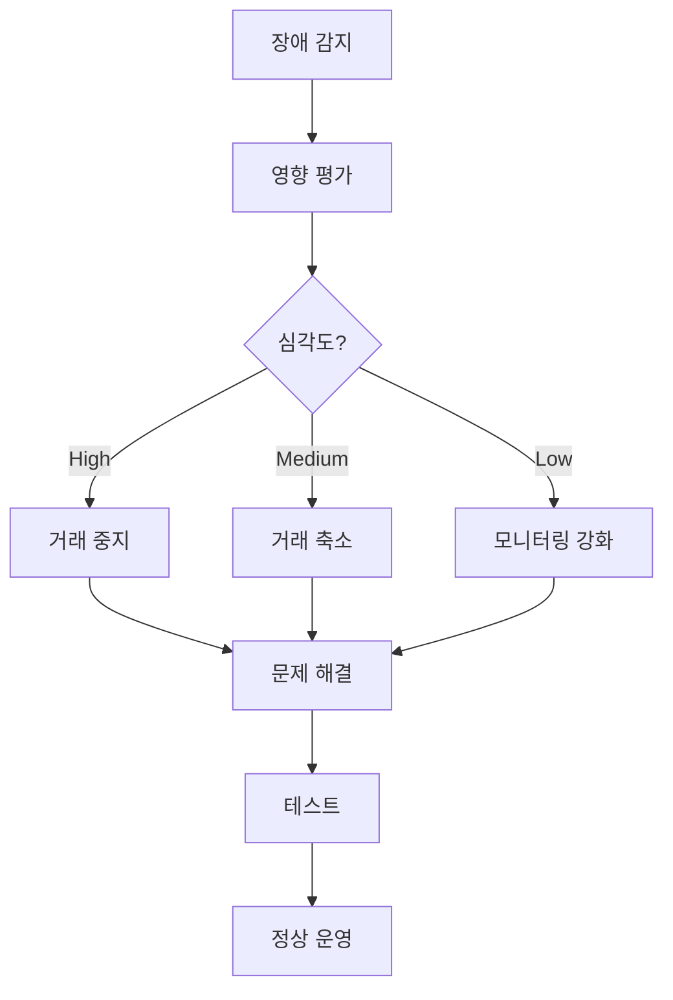

---

## 14. 결론

본 C4 모델 기반 소프트웨어 아키텍처 문서는 코인 선물 자동매매 시스템의 전체 구조를 체계적으로 정의합니다. 

### 핵심 아키텍처 원칙

1. **모듈성**: 각 컴포넌트가 독립적으로 개발/배포 가능
2. **확장성**: 거래량 증가에 따른 수평 확장 지원
3. **복원력**: 장애 시 자동 복구 및 fail-safe 메커니즘
4. **관찰 가능성**: 모든 레벨에서 상태 모니터링 가능
5. **보안성**: 다층 보안 아키텍처 적용

이 아키텍처는 설계 문서의 금융공학 모델과 리스크 관리 체계를 실제 운영 가능한 소프트웨어 시스템으로 구현하기 위한 청사진을 제공합니다.